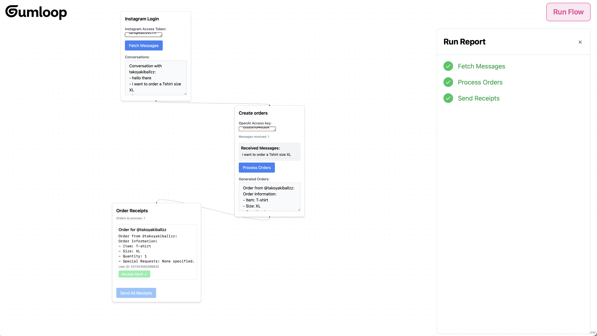
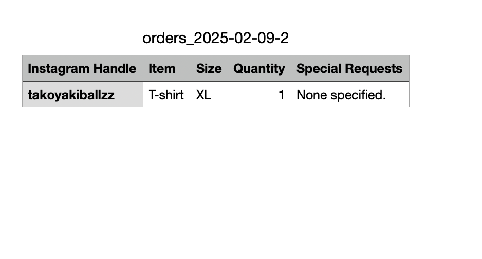
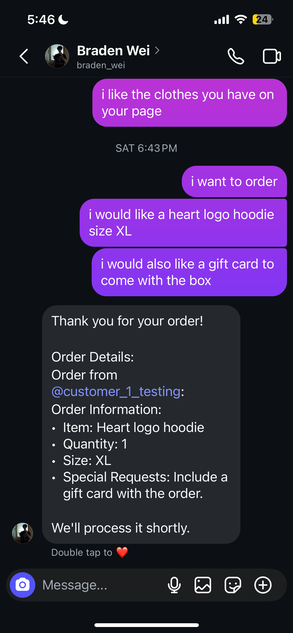

https://ig-business-order-automation.vercel.app
# Instagram Business Order Automation

## Overview
This workflow automates order processing for Instagram business owners by:
- Scanning customer messages to identify orders.
- Using ChatGPT to generate order receipts.
- Storing receipts in a CSV file that directly goes to your download and you can track orders by opening them in Google Sheets.
- Sending the order receipt back to the customer.
  

This system increases efficiency by eliminating the work of manually taking large amount of orders and streamlining communication with customers.

## Features
- Automated Message Parsing:** Reads all chats and extracts order details.
- AI-Powered Order Processing:** Identifies orders using ChatGPT.
- Receipt Generation:** Creates order receipts in CSV format and syncs with Google Sheets.
- Automated Customer Interaction:** Sends receipts directly to customers.
- Efficiency Boost:** Reduces manual effort in handling large order volumes.
## Order CSV file preview: 

## Instagram Chat preview(Automated message): 

### Prerequisites
Ensure you have the following installed:
- **Node.js** (for the frontend and automation scripts)
- **Python** (for backend processing)
- **Git** (for version control)
- **Instagram API Access** (or a web scraping solution if API access is unavailable)
- To run this workflow you are required to have a instagram access token and open ai token. 

## Deployment

Frontend: Deployed on Vercel

Backend (Flask API): Hosted on Render
This makes the system fully accessible online, with real-time integration between React Flow and the AI-powered backend.

## Tech Stack

- React
- TypeScript
- [React Flow](https://reactflow.dev/)
- Zustand (State Management)
- Tailwind CSS
- Axios

## License
This project is licensed under the **MIT License**.

